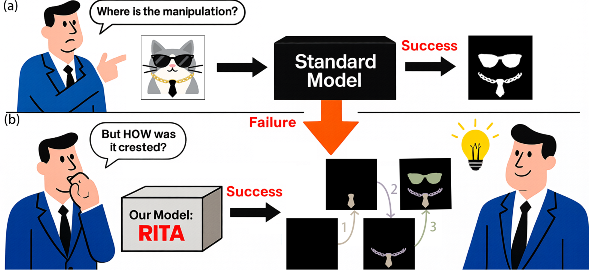

## [CVPR 2026 Findings] Revisiting Image Manipulation Localization under Realistic Manipulation Scenarios

This repository contains the official PyTorch implementation of our CVPR 2026 Findings paper: "[Revisiting Image Manipulation Localization under Realistic Manipulation Scenarios](https://arxiv.org/abs/2509.20006)".
  

RITA is a model framework that first identifies the phenomenon of dimension collapse in image manipulation localization, where realistic manipulation scenarios are often reduced to simplified binary localization settings. Beyond proposing a new framework, RITA provides a systematic discussion of this issue from three perspectives: dataset construction, model design, and future research directions. In particular, it highlights the importance of moving beyond static tampered-region annotations toward process-aware manipulation understanding, aiming to promote more realistic and generalizable image manipulation localization.

### Code & Dataset Release

We are gradually releasing the code, pretrained models, and datasets for this project.

### Currently Available

* Inference code under the CAT-Net protocol
* Training code


## Test

<details>
<summary>Inference under the CAT-Net protocol</summary>
Please first download the required files from Baidu Netdisk:

```text
Baidu Netdisk link: https://pan.baidu.com/s/1W1HC4_mn044ub2NLJLSeQQ?pwd=43nn
```

Before running the inference script, please modify the dataset paths in `test.py` and `test_robustness.py` according to your local environment. Then replace the checkpoint path in `test.sh` with the downloaded pretrained model path.

After that, run:

```bash
bash test.sh
```

</details>

## Train

<details>
<summary>Training under the CAT-Net protocol</summary>

Before running the training script, please modify the dataset paths in the corresponding JSON configuration files according to your local environment.

After that, run:

```bash
sh train_catnet.sh
```

</details>

### TODO List

We will continue to update this repository with the following components:

* ✅ Inference code
* ✅ Training code
* [ ] Synthetic datasets
* [ ] HSIM dataset
* [ ] Autoregressive inference code

More code and data will be made publicly available as soon as possible.


## Acknowledgements

We thank the [IMDLBenCo](https://github.com/scu-zjz/IMDLBenCo) repository for its support. RITA is developed based on IMDLBenCo and further adapted to process-aware sequential manipulation localization.

## Citation

If you find our work interesting or helpful, please don't hesitate to give us a star🌟 and cite our paper🥰! Your support truly encourages us!
```bibtex
@inproceedings{zhu2026revisiting,
  title={Revisiting Image Manipulation Localization under Realistic Manipulation Scenarios},
  author={Zhu, Xuekang and Zhou, Ji-Zhe and Feng, Kaiwen and Qu, Chenfan and Wang, Xiwen and Wang, Yunfei and Zhou, Liting and Liu, Jian},
  booktitle={Proceedings of the IEEE/CVF Conference on Computer Vision and Pattern Recognition},
  pages={7198--7207},
  year={2026}
}
```